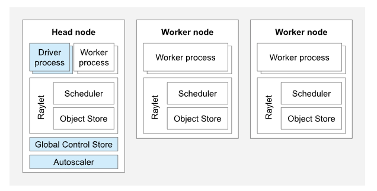
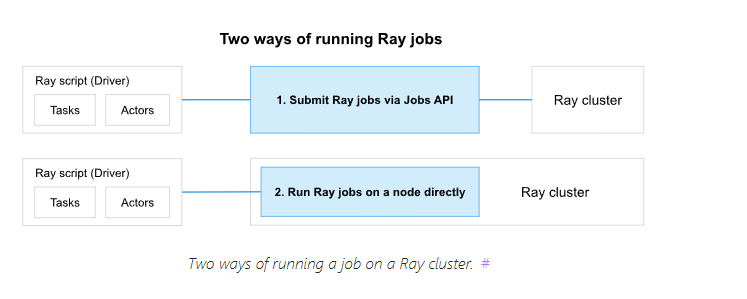

# Key concept
---
## Task
- Là hàm (function) được chạy bất đồng bộ (asynchronous) trên Ray cluster.
- Khi bạn gọi @ray.remote trên 1 function và thực thi nó, Ray sẽ gửi hàm đó đi để worker thực thi.

### Ví dụ
```bash
import ray
ray.init()

@ray.remote
def f(x):
    return x * x

futures = [f.remote(i) for i in range(4)]
```
→ f.remote(i) không trả về kết quả ngay, mà trả về một ObjectRef (giống future/promise).

---
## Actor
- Actor là một instance stateful chạy trên 1 worker, giữ được trạng thái (state) qua nhiều lời gọi hàm.
- Bạn có thể coi nó như 1 class triển khai remote.
- Khi bạn gọi MyActor.remote(), Ray sẽ tạo 1 tiến trình mới chạy Actor đó.
- Actor có thể xử lý nhiều request tuần tự, nhưng bạn có thể tạo nhiều Actor để chạy song song.

### Ví dụ
```bash
@ray.remote
class Counter:
    def __init__(self):
        self.value = 0

    def increment(self):
        self.value += 1
        return self.value

counter = Counter.remote()
print(ray.get(counter.increment.remote()))  # 1
print(ray.get(counter.increment.remote()))  # 2
```

---
## Object
- Mỗi kết quả của 1 Task hoặc Actor method được lưu trong Object Store (plasma store) của Ray.
- Các Object này không trả trực tiếp mà được bọc trong ObjectRef.
- Bạn dùng ray.get(object_ref) để lấy giá trị thật.
- Ưu điểm: Object store có thể chia sẻ dữ liệu giữa các task/actor mà không cần copy nhiều lần (zero-copy).

### Ví dụ
```bash
results = ray.get(futures)
print(results)  # [0, 1, 4, 9]
```

---
# Ray Cluster

Gồm:
- 1 **head node**
- 1 hoặc nhiều **worker nodes**



- Số lượng worker nodes sẽ được scale bởi **autoscaler** 


## Head node
- Giống các worker node, nhưng có thêm các tiến trình đơn lẻ chịu trách nhiệm quản lý cụm như **autoscaler**, **GCS**, tiến trình **Ray driver** chạy **Ray jobs**. Ray có thể lập lịch các task và actor trên node head giống các worker node.

## Worker node
- Không chạy bất kỳ tiến trình quản lý node nào. và chỉ phục vụ chạy user code trong Ray **tasks** và **actors**

## Autoscaling
- **Ray autoscaler** Là tiến trình chạy trên head node hoặc laf sidecar container trong head pod (kubernetes).
    - Khi yêu cầu về tài nguyên vượt quá khả năng hiện tại của cụm thì autoscaler sẽ cố gắng tăng số worker nodes hoặc worker pods (k8s)

## Ray jobs
- là 1 ứng dụng đơn
    - thu thập các Ray tasks, objects, actors từ cùng 1 script.
    - Worker chạy python script gọi là driver của job

### Cách chạy
