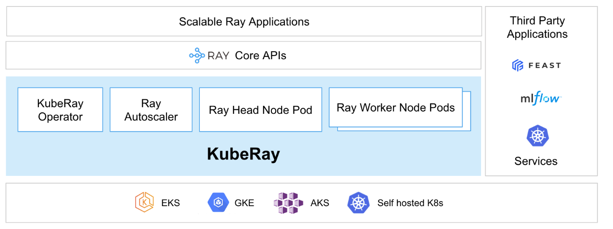
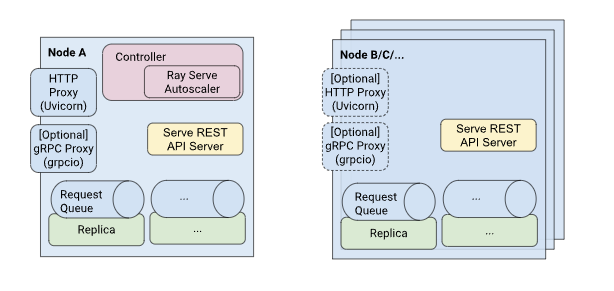
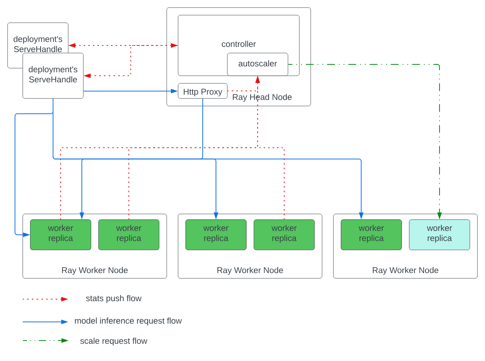

# Ray on K8s

## Requirement
-  KubeRay operator

## KubeRay
KubeRay is a powerful, open-source Kubernetes operator that simplifies the deployment and management of [Ray](https://github.com/ray-project/ray) applications on Kubernetes. It offers several key components:

**KubeRay core**: This is the official, fully-maintained component of KubeRay that provides three custom resource definitions, RayCluster, RayJob, and RayService. These resources are designed to help you run a wide range of workloads with ease.

* **RayCluster**: KubeRay fully manages the lifecycle of RayCluster, including cluster creation/deletion, autoscaling, and ensuring fault tolerance.

* **RayJob**: With RayJob, KubeRay automatically creates a RayCluster and submits a job when the cluster is ready. You can also configure RayJob to automatically delete the RayCluster once the job finishes.

* **RayService**: RayService is made up of two parts: a RayCluster and a Ray Serve deployment graph. RayService offers zero-downtime upgrades for RayCluster and high availability.

## Overview Architecture

### Ví dụ chạy với
- **RayCluster**: https://docs.ray.io/en/latest/cluster/kubernetes/getting-started/raycluster-quick-start.html#kuberay-raycluster-quickstart
- **RayJob**: https://docs.ray.io/en/latest/cluster/kubernetes/getting-started/rayjob-quick-start.html#kuberay-rayjob-quickstart
- **RayService**: https://docs.ray.io/en/latest/cluster/kubernetes/getting-started/rayservice-quick-start.html#kuberay-rayservice-quickstart

### RayService
- có 2 thành phần:
    - **RayCluster**: Manages resources in a Kubernetes cluster.
    - **Ray Serve Applications**: Manages users’ applications.

- RayService hỗ trợ:
    - **Kubernetes-native support for Ray clusters and Ray Serve applications**: After using a Kubernetes configuration to define a Ray cluster and its Ray Serve applications, you can use kubectl to create the cluster and its applications.
    - **In-place updates for Ray Serve applications**: Users can update the Ray Serve configuration in the RayService CR configuration and use kubectl apply to update the applications. See Step 7 for more details.
    - **Zero downtime upgrades for Ray clusters**: Users can update the Ray cluster configuration in the RayService CR configuration and use kubectl apply to update the cluster. RayService temporarily creates a pending cluster and waits for it to be ready, then switches traffic to the new cluster and terminates the old one. See Step 8 for more details.
    - **High-availabilable services**: See RayService high availability for more details.

### Ray Serve

**Loại actors được tạo để sử dụng Servce instance:**
- **Controller:** một global actor duy nhất cho mỗi Serve instance, chịu trách nhiệm quản lý control plane. Controller phụ trách việc tạo, cập nhật và hủy các actor khác. Các lệnh gọi API của Serve như tạo hoặc lấy deployment thực chất là các remote call đến Controller.
- **HTTP Proxy:**: Mặc định sẽ có một HTTP proxy actor chạy trên head node. Actor này chạy một server Uvicorn HTTP, nhận request từ bên ngoài, chuyển tiếp chúng đến các replica, và trả kết quả khi hoàn tất.
Để tăng khả năng mở rộng và độ sẵn sàng cao, bạn cũng có thể chạy một proxy trên mỗi node trong cluster bằng cách cấu hình proxy_location trong serve.start() hoặc file config.
- **gRPC Proxy:** Nếu Serve được khởi động với port hợp lệ và grpc_servicer_functions, thì gRPC proxy sẽ chạy song song với HTTP proxy. Actor này chạy một server grpcio, nhận các request gRPC, chuyển tiếp đến replica, và trả kết quả khi hoàn tất.
- **Replicas:** Các actor này thực thi code để xử lý request. Ví dụ: mỗi replica có thể chứa một model ML. Mỗi replica xử lý các request từ proxy, và có thể batch nhiều request cùng lúc bằng @serve.batch. (Xem docs về batching).

**Vòng đời của 1 request**
1. Request nhận và được parse
2. Ray Serve tìm deployment tương ứng dựa trên HTTP URL và metadata tên ứng dụng. Serve đặt request vào hàng đợi
3. Với mỗi request trong hàng đợi của một deployment, Ray Serve tìm một replica khả dụng và gửi request đến nó. Nếu không có replica nào khả dụng (ví dụ mỗi replica đã nhận số request tối đa = max_ongoing_requests), thì request sẽ ở lại trong queue cho đến khi có replica trống.
4. Mỗi replica duy trì một queue request riêng và xử lý từng request một, có thể dùng asyncio để xử lý đồng thời.
    - Nếu handler (hàm deployment hoặc __call__ của deployment class) được khai báo bằng async def, replica sẽ không chặn (non-blocking).
    - Nếu không, replica sẽ block cho đến khi handler trả về kết quả.
5. Khi gọi request thông qua DeploymentHandle (thay vì HTTP/gRPC, ví dụ khi ghép model), request sẽ được đưa vào queue của DeploymentHandle, rồi nhảy đến bước 3 ở trên.

### Host model lên gọi là ML application (Ray Servce application)
