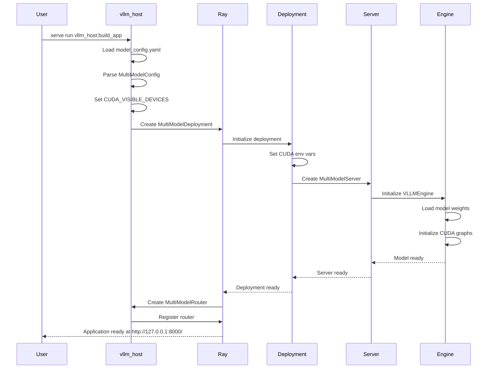
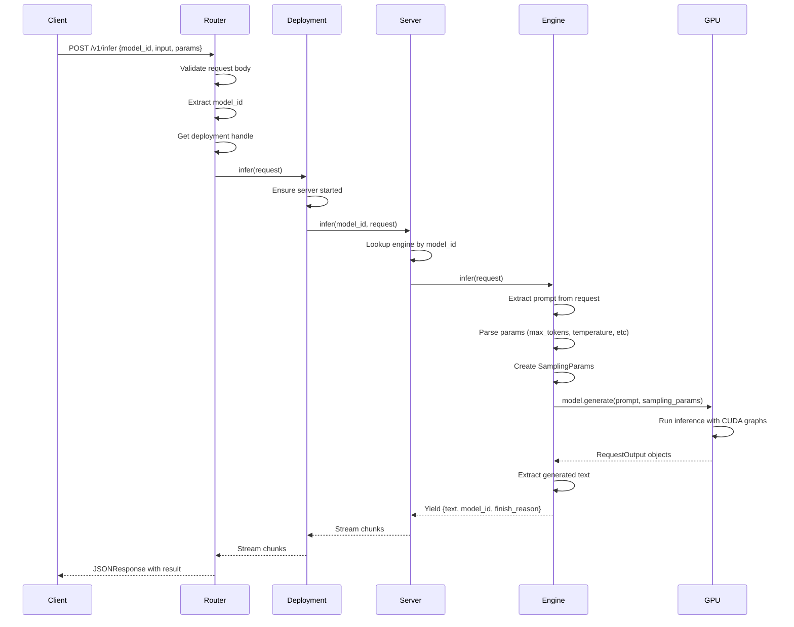
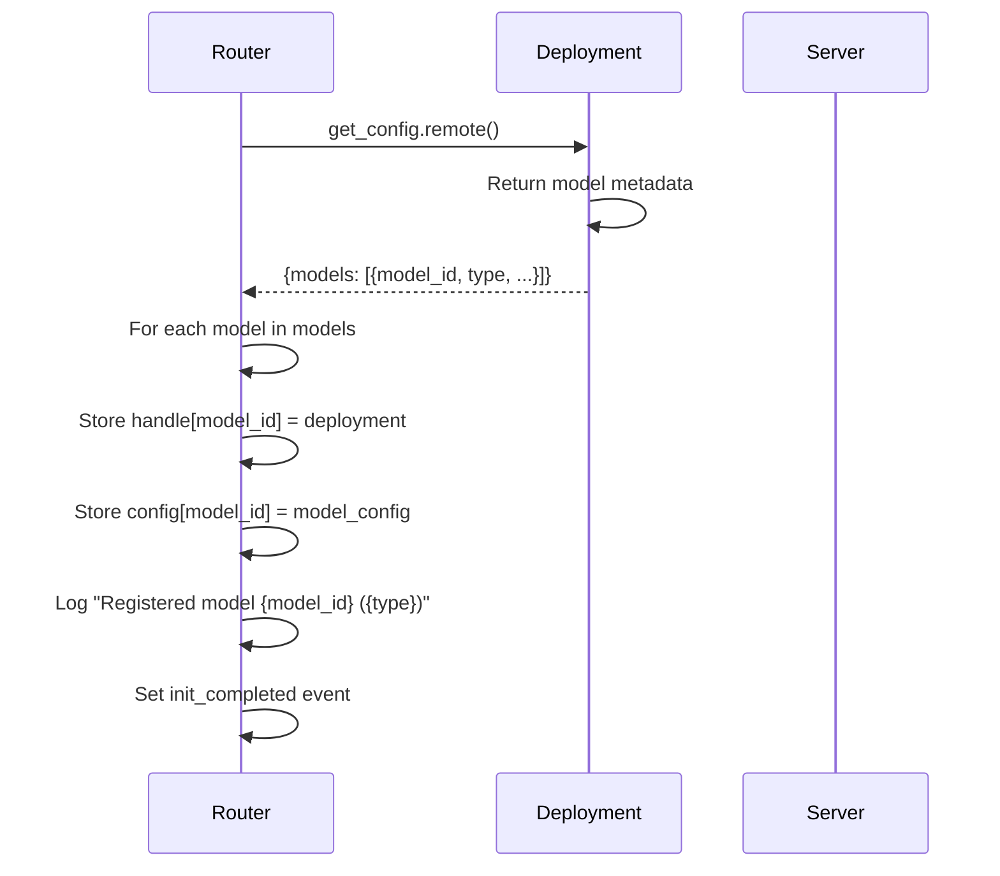

# Ray Serve Multi-Model Deployment Platform

## 📋 Mục Lục
- [Tổng Quan](#tổng-quan)
- [Kiến Trúc Hệ Thống](#kiến-trúc-hệ-thống)
- [Cấu Trúc Thư Mục](#cấu-trúc-thư-mục)
- [Flow Hoạt Động](#flow-hoạt-động)
- [Chi Tiết Components](#chi-tiết-components)
- [Cấu Hình](#cấu-hình)
- [Cài Đặt và Triển Khai](#cài-đặt-và-triển-khai)
- [API Endpoints](#api-endpoints)
- [Troubleshooting](#troubleshooting)

---

## 🎯 Tổng Quan

Hệ thống Multi-Model Deployment Platform được xây dựng trên **Ray Serve** và **VLLM**, cho phép triển khai và quản lý nhiều mô hình AI khác nhau (LLM, Audio, Vision, Video) trên cùng một cluster.

### ✨ Tính Năng Chính

- **Multi-Model Support**: Hỗ trợ nhiều loại mô hình (VLLM, Audio, Vision, Video)
- **Scalable Architecture**: Tự động scale theo nhu cầu với Ray Serve
- **Unified API**: REST API thống nhất cho tất cả các loại mô hình
- **GPU Optimization**: Tối ưu hóa sử dụng GPU với CUDA graphs
- **Health Monitoring**: Theo dõi sức khỏe của từng mô hình
- **Dynamic Routing**: Router thông minh phân phối request đến đúng mô hình

### 🔧 Công Nghệ Sử Dụng

- **Ray Serve**: Framework serving phân tán
- **VLLM**: Engine tối ưu cho LLM inference
- **FastAPI**: Web framework cho REST API
- **Pydantic**: Data validation
- **CUDA**: GPU acceleration

---

## 🏗️ Kiến Trúc Hệ Thống

```
┌─────────────────────────────────────────────────────────────┐
│                     Client Request                          │
│                  (HTTP POST /v1/infer)                      │
└──────────────────────┬──────────────────────────────────────┘
                       │
                       ▼
┌─────────────────────────────────────────────────────────────┐
│                  MultiModelRouter                           │
│  - Route requests to appropriate deployment                 │
│  - Load balancing across replicas                           │
│  - Health checking                                           │
└──────────────────────┬──────────────────────────────────────┘
                       │
                       ▼
┌─────────────────────────────────────────────────────────────┐
│              MultiModelDeployment                           │
│  - Manages multiple model instances                         │
│  - Handles CUDA device allocation                           │
│  - Coordinates MultiModelServer                             │
└──────────────────────┬──────────────────────────────────────┘
                       │
                       ▼
┌─────────────────────────────────────────────────────────────┐
│               MultiModelServer                              │
│  - Initializes and manages engines                          │
│  - Dispatches requests to correct engine                    │
│  - Handles concurrent requests                              │
└──────────────────────┬──────────────────────────────────────┘
                       │
          ┌────────────┼────────────┬────────────┐
          ▼            ▼            ▼            ▼
    ┌─────────┐  ┌─────────┐  ┌─────────┐  ┌─────────┐
    │  VLLM   │  │  Audio  │  │ Vision  │  │  Video  │
    │ Engine  │  │ Engine  │  │ Engine  │  │ Engine  │
    └─────────┘  └─────────┘  └─────────┘  └─────────┘
          │            │            │            │
          └────────────┴────────────┴────────────┘
                       │
                       ▼
                 ┌──────────┐
                 │   GPU    │
                 │  (CUDA)  │
                 └──────────┘
```

---

## 📁 Cấu Trúc Thư Mục

```
/home/terraform/ray/
│
├── 📄 vllm_host.py              # Main entry point - khởi động ứng dụng
├── 📄 model_config.yaml         # Cấu hình mô hình chính
├── 📄 serve.log                 # Log file của ứng dụng
├── 📄 README.md                 # Tài liệu này
│
├── 📁 serve/                    # Ray Serve deployments và routing
│   ├── 📁 deployments/
│   │   ├── multi_model_deployment.py   # Ray Serve deployment wrapper
│   │   └── multi_model_server.py       # Server quản lý nhiều engines
│   │
│   └── 📁 router/
│       └── router.py                    # FastAPI router, điều hướng requests
│
├── 📁 servers/                  # Engine implementations
│   ├── base_engine.py          # Abstract base class cho tất cả engines
│   ├── vllm_engine.py          # VLLM engine cho LLM models
│   ├── audio_engine.py         # Engine cho audio models (TODO)
│   ├── vision_engine.py        # Engine cho vision models (TODO)
│   └── video_engine.py         # Engine cho video models (TODO)
│
├── 📁 configs/                  # Configuration models
│   ├── server_models.py        # Pydantic models cho LLM config
│   ├── audio_models.py         # Config cho audio models
│   ├── vision_models.py        # Config cho vision models
│   ├── video_models.py         # Config cho video models
│   └── open_api_models.py      # OpenAPI schema definitions
│
├── 📁 common/                   # Shared utilities
│   └── base_pydantic.py        # Base Pydantic configurations
│
├── 📁 cloud/                    # Cloud deployment utilities
│   └── cloud_utils.py          # Utilities cho cloud deployment
│
└── 📁 venv/                     # Python virtual environment
```

---

## 🔄 Flow Hoạt Động

### 1️⃣ **Khởi Động Ứng Dụng (Application Startup)**



#### Chi Tiết Các Bước:

**Step 1: Load Configuration**
- `vllm_host.py` đọc file `model_config.yaml`
- Parse cấu hình thành `MultiModelConfig` objects
- Mỗi config chứa: `model_loading_config`, `deployment_config`, `engine_kwargs`

**Step 2: Environment Setup**
- Đọc `CUDA_VISIBLE_DEVICES` từ environment
- Set runtime environment cho Ray actors
- Đảm bảo subprocesses kế thừa CUDA settings

**Step 3: Deployment Creation**
- Tạo `MultiModelDeployment` instances cho mỗi model
- Mỗi deployment là một Ray actor độc lập
- Apply autoscaling config và resource limits

**Step 4: Model Loading**
- `MultiModelServer` khởi tạo engines dựa trên type (VLLM, Audio, etc.)
- VLLM engine load model weights từ HuggingFace
- Compile model với torch.compile
- Capture CUDA graphs cho optimization

**Step 5: Router Registration**
- `MultiModelRouter` gọi `get_config()` từ mỗi deployment
- Register model_id và type mapping
- Setup FastAPI routes

---

### 2️⃣ **Request Processing Flow (Xử Lý Request)**



#### Chi Tiết Các Bước:

**Step 1: Request Validation (Router)**
```python
# router.py - infer_api()
{
    "model_id": "falcon3-1b-instruct",
    "input": "Hello, how are you?",
    "params": {
        "max_tokens": 256,
        "temperature": 0.7
    }
}
```

**Step 2: Deployment Dispatch**
- Router tìm deployment handle tương ứng với `model_id`
- Gọi `deployment.infer.remote()` với stream=True
- Ray handle request routing và load balancing

**Step 3: Server Processing**
- MultiModelServer lookup engine từ `self.models` dict
- Validate model_id exists
- Dispatch request đến engine tương ứng

**Step 4: Engine Inference**
```python
# vllm_engine.py - infer()
sampling_params = SamplingParams(
    max_tokens=params.get("max_tokens", 256),
    temperature=params.get("temperature", 0.7),
    top_p=params.get("top_p", 1.0),
    top_k=params.get("top_k", -1)
)
outputs = await loop.run_in_executor(
    None, 
    lambda: self.model.generate(prompt, sampling_params=sampling_params)
)
```

**Step 5: Response Streaming**
- Engine yield chunks as they're generated
- Async generator pattern cho streaming responses
- Client nhận được response ngay khi inference hoàn tất

---

### 3️⃣ **Model Registration Flow**



---

## Chi Tiết Components

### 1. **vllm_host.py** - Application Entry Point

**Chức năng:**
- Entry point chính của ứng dụng
- Load và parse configuration từ YAML
- Khởi tạo Ray Serve deployments
- Setup routing và networking

**Key Functions:**

```python
def build_app(args: dict) -> Deployment:
    """
    Build and return the Ray Serve application.
    
    Args:
        args: Dictionary chứa config_path và các tham số khác
        
    Returns:
        Router deployment đã được configure
    """
    
def load_multi_model_config(yaml_path: str) -> List[MultiModelConfig]:
    """
    Load multiple model configurations from YAML.
    
    Returns:
        List of MultiModelConfig objects
    """
    
def print_configs(configs: List[MultiModelConfig]):
    """
    Pretty print loaded configurations using Rich tables.
    """
```

**Flow:**
1. Đọc `model_config.yaml`
2. Parse thành `MultiModelConfig` objects
3. Tạo deployments với Ray actor options
4. Bind router với deployments
5. Return router deployment

---

### 2. **serve/deployments/multi_model_deployment.py** - Deployment Wrapper

**Chức năng:**
- Ray Serve deployment wrapper
- Quản lý lifecycle của MultiModelServer
- Handle CUDA environment variables
- Expose API methods cho router

**Key Components:**

```python
@serve.deployment(
    autoscaling_config={...},
    max_ongoing_requests=256,
    health_check_period_s=10,
)
class MultiModelDeployment:
    """
    Deployment wrapping MultiModelServer.
    Each deployment can host multiple models.
    """
    
    def __init__(self, llm_configs: List[LLMConfig]):
        # Set CUDA_VISIBLE_DEVICES for subprocesses
        # Initialize MultiModelServer
        # Register models metadata
        
    async def get_config(self) -> Dict[str, Any]:
        """Return metadata for router registration."""
        
    async def infer(self, request: Dict[str, Any]) -> AsyncGenerator:
        """Unified inference entrypoint."""
        
    async def check_health(self) -> Dict[str, Any]:
        """Health check endpoint."""
```

**Quan Trọng:**
- **CUDA Environment**: Đảm bảo `CUDA_VISIBLE_DEVICES` được set trong `__init__` để VLLM multiprocessing.spawn kế thừa
- **Async Initialization**: Sử dụng `_ensure_started()` để đảm bảo server đã khởi động trước khi xử lý requests

---

### 3. **serve/deployments/multi_model_server.py** - Model Server

**Chức năng:**
- Quản lý nhiều engine instances
- Engine registry và factory pattern
- Dispatch requests đến đúng engine
- Health monitoring

**Architecture:**

```python
# Engine Registry Pattern
ENGINE_REGISTRY = {
    "VLLM": VLLMEngine,
    "AUDIO": AudioEngine,
    "VISION": VisionEngine,
    "VIDEO": VideoEngine,
}

@register_engine("VLLM")
class VLLMEngine(BaseEngine):
    """Decorator tự động register engine vào registry."""
```

**Key Methods:**

```python
async def start(self):
    """
    Load all models concurrently using asyncio.gather.
    Significantly faster than sequential loading.
    """
    
async def _start_model(self, cfg: LLMConfig):
    """
    Initialize a single engine:
    1. Lookup engine class from registry
    2. Instantiate engine with config
    3. Call engine.start() to load model
    4. Store in self.models dict
    """
    
async def infer(self, model_id: str, request: Any) -> AsyncGenerator:
    """
    Dispatch inference to correct engine.
    Handles streaming responses.
    """
```

---

### 4. **servers/vllm_engine.py** - VLLM Engine Implementation

**Chức năng:**
- Implement BaseEngine interface cho VLLM
- Load và manage LLM models
- Handle inference với SamplingParams
- GPU memory management

**Implementation:**

```python
@register_engine("VLLM")
class VLLMEngine(BaseEngine):
    async def start(self):
        """
        Load VLLM model:
        1. Log CUDA_VISIBLE_DEVICES
        2. Fix tensor_parallel_size if needed
        3. Initialize LLM in thread pool executor
        """
        
    async def infer(self, request):
        """
        Run inference:
        1. Extract prompt from request
        2. Create SamplingParams from params
        3. Call model.generate() in thread pool
        4. Stream results as async generator
        
        CRITICAL: Use SamplingParams instead of **kwargs
        """
```

**SamplingParams Pattern:**

```python
# WRONG - Direct kwargs
outputs = self.model.generate(prompt, max_tokens=256, temperature=0.7)

# CORRECT - SamplingParams object
sampling_params = SamplingParams(
    max_tokens=256,
    temperature=0.7,
    top_p=1.0,
    top_k=-1
)
outputs = self.model.generate(prompt, sampling_params=sampling_params)
```

---

### 5. **serve/router/router.py** - FastAPI Router

**Chức năng:**
- FastAPI application với CORS
- REST API endpoints
- Model discovery và registration
- Request routing với timeout handling

**API Endpoints:**

```python
@router_app.post("/v1/infer")
async def infer_api(self, body: Dict[str, Any]):
    """
    General multimodal inference endpoint.
    
    Request:
        {
            "model_id": "falcon3-1b-instruct",
            "input": "Your prompt here",
            "params": {
                "max_tokens": 256,
                "temperature": 0.7
            }
        }
    
    Response:
        {
            "text": "Generated text...",
            "model_id": "falcon3-1b-instruct",
            "finish_reason": "stop"
        }
    """

@router_app.get("/v1/models")
async def list_models(self):
    """
    List all registered models.
    
    Response:
        {
            "models": [
                {
                    "model_id": "falcon3-1b-instruct",
                    "type": "VLLM",
                    "engine_kwargs": {...},
                    "deployment_config": {...}
                }
            ]
        }
    """

@router_app.get("/v1/models/{model_id}")
async def model_info(self, model_id: str):
    """Get detailed info for specific model."""
```

**Router Initialization:**

```python
async def _setup_handle_map(self, model_deployments: List[DeploymentHandle]):
    """
    Register all models from deployments:
    1. Call get_config.remote() on each deployment
    2. Extract model metadata
    3. Store deployment handle and config
    4. Log registration
    5. Set init_completed event
    """
```

---

### 6. **configs/server_models.py** - Configuration Models

**Chức năng:**
- Pydantic models cho type-safe configuration
- Validation và serialization
- Default values và constraints

**Key Models:**

```python
class MultiModelConfig(BasePydantic):
    """
    Configuration for a single model.
    
    Attributes:
        model_loading_config: Dict with model_id, model_source, type
        deployment_config: Ray Serve deployment settings
        engine_kwargs: Engine-specific parameters
    """
    model_loading_config: Dict[str, Any]
    deployment_config: Dict[str, Any] = {}
    engine_kwargs: Dict[str, Any] = {}
```

---

## ⚙️ Cấu Hình

### model_config.yaml Structure

```yaml
applications:
  - name: "falcon3-1b-instruct-app"
    import_path: "ray.serve.llm:build_openai_app"
    route_prefix: "/falcon3-1b"
    args:
      llm_configs:
        - model_loading_config:
            model_id: "falcon3-1b-instruct"           # Unique identifier
            model_source: "tiiuae/Falcon3-1B-Instruct"  # HuggingFace path
            type: "VLLM"                              # Engine type
          
          deployment_config:
            name: "falcon3-1b-deployment"
            ray_actor_options:
              num_cpus: 1                            # CPUs per replica
              num_gpus: 0.4                          # GPU fraction
            autoscaling_config:
              min_replicas: 1                        # Minimum instances
              max_replicas: 1                        # Maximum instances
              target_ongoing_requests: 50            # Scale trigger
            max_ongoing_requests: 256                # Max concurrent requests
          
          engine_kwargs:
            # VLLM-specific parameters
            tensor_parallel_size: 0                  # Multi-GPU (0 = auto)
            dtype: "float16"                         # Model precision
            gpu_memory_utilization: 0.4              # GPU memory fraction
            max_model_len: 8192                      # Max sequence length
            enforce_eager: false                     # Use CUDA graphs
            max_num_seqs: 256                        # Concurrent sequences
            max_num_batched_tokens: 32768            # Batch size
            trust_remote_code: true                  # Allow custom code
            disable_custom_all_reduce: true          # Disable custom kernels
```

### Environment Variables

```bash
# CUDA Configuration
export CUDA_VISIBLE_DEVICES=0              # GPU indices to use

# Ray Configuration
export RAY_ACCEL_ENV_VAR_OVERRIDE_ON_ZERO=0  # Disable GPU override warning

# Model Configuration
export MODEL_CONFIG_PATH=model_config.yaml   # Path to config file
```

---

## Cài Đặt và Triển Khai

### Prerequisites

```bash
# System requirements
- Python 3.10+
- CUDA 11.8+ (for GPU support)
- 16GB+ RAM
- GPU with 8GB+ VRAM (for Falcon3-1B)
```

### Installation Steps

#### 1. Clone Repository

```bash
cd /home/terraform
git clone <repository-url> ray
cd ray
```

#### 2. Create Virtual Environment

```bash
python3 -m venv venv
source venv/bin/activate
```

#### 3. Install Dependencies

```bash
# Install Ray and Ray Serve
pip install "ray[serve]"

# Install VLLM
pip install vllm

# Install other dependencies
pip install fastapi uvicorn pydantic pyyaml rich async-timeout

# Install PyArrow (required for Ray)
pip install pyarrow
```

#### 4. Verify CUDA Setup

```bash
python -c "import torch; print(f'CUDA Available: {torch.cuda.is_available()}')"
python -c "import torch; print(f'CUDA Version: {torch.version.cuda}')"
python -c "import torch; print(f'GPU Count: {torch.cuda.device_count()}')"
```

### Deployment

#### 1. Start Ray Cluster

```bash
# Set CUDA devices
export CUDA_VISIBLE_DEVICES=0

# Start Ray head node
ray start --head --num-cpus=8
```

#### 2. Start Application

```bash
# Method 1: Foreground (for testing)
serve run vllm_host:build_app

# Method 2: Background (for production)
nohup serve run vllm_host:build_app > serve.log 2>&1 &

# Method 3: With custom config
MODEL_CONFIG_PATH=custom_config.yaml serve run vllm_host:build_app
```

#### 3. Verify Deployment

```bash
# Check Ray status
ray status

# Check application logs
tail -f serve.log

# Wait for "Application ready" message
# Expected: "INFO ... -- Application 'default' is ready at http://127.0.0.1:8000/."
```

#### 4. Test Endpoint

```bash
# List available models
curl -X GET http://127.0.0.1:8000/v1/models

# Test inference
curl -X POST http://127.0.0.1:8000/v1/infer \
  -H "Content-Type: application/json" \
  -d '{
    "model_id": "falcon3-1b-instruct",
    "input": "Hello, how are you?",
    "params": {
      "max_tokens": 256,
      "temperature": 0.7
    }
  }'
```

### Stop Deployment

```bash
# Stop Ray Serve
# (If running in foreground, press Ctrl+C)

# Stop Ray cluster
ray stop

# Kill background process (if using nohup)
pkill -f "serve run"
```

---

## 🔌 API Endpoints

### Base URL

```
http://127.0.0.1:8000
```

### Endpoints

#### 1. **POST /v1/infer** - Run Inference

**Request:**

```json
{
  "model_id": "falcon3-1b-instruct",
  "input": "Write a poem about the ocean",
  "params": {
    "max_tokens": 512,
    "temperature": 0.8,
    "top_p": 0.95,
    "top_k": 50,
    "frequency_penalty": 0.0,
    "presence_penalty": 0.0
  }
}
```

**Response:**

```json
{
  "text": "The ocean vast and deep...",
  "model_id": "falcon3-1b-instruct",
  "finish_reason": "stop"
}
```

**Parameters:**

| Parameter | Type | Default | Description |
|-----------|------|---------|-------------|
| `model_id` | string | **required** | ID của model cần sử dụng |
| `input` hoặc `prompt` | string | **required** | Input text cho model |
| `params.max_tokens` | integer | 256 | Số token tối đa để generate |
| `params.temperature` | float | 0.7 | Sampling temperature (0-2) |
| `params.top_p` | float | 1.0 | Nucleus sampling threshold |
| `params.top_k` | integer | -1 | Top-k sampling (-1 = disabled) |
| `params.frequency_penalty` | float | 0.0 | Frequency penalty (-2 to 2) |
| `params.presence_penalty` | float | 0.0 | Presence penalty (-2 to 2) |

---

#### 2. **GET /v1/models** - List All Models

**Request:**

```bash
curl -X GET http://127.0.0.1:8000/v1/models
```

**Response:**

```json
{
  "models": [
    {
      "model_id": "falcon3-1b-instruct",
      "type": "VLLM",
      "engine_kwargs": {
        "dtype": "float16",
        "gpu_memory_utilization": 0.4,
        "max_model_len": 8192
      },
      "deployment_config": {
        "name": "falcon3-1b-deployment",
        "autoscaling_config": {
          "min_replicas": 1,
          "max_replicas": 1
        }
      }
    }
  ]
}
```

---

#### 3. **GET /v1/models/{model_id}** - Get Model Info

**Request:**

```bash
curl -X GET http://127.0.0.1:8000/v1/models/falcon3-1b-instruct
```

**Response:**

```json
{
  "model_id": "falcon3-1b-instruct",
  "type": "VLLM",
  "engine_kwargs": { ... },
  "deployment_config": { ... }
}
```

---

## 🐛 Troubleshooting

### Common Issues

#### 1. **"No CUDA GPUs are available"**

**Problem:**
```
RuntimeError: No CUDA GPUs are available
```

**Solutions:**

```bash
# Check CUDA_VISIBLE_DEVICES
echo $CUDA_VISIBLE_DEVICES

# Set explicitly in deployment __init__
os.environ['CUDA_VISIBLE_DEVICES'] = '0'

# Verify GPU visibility
python -c "import torch; print(torch.cuda.device_count())"
```

**Root Cause:**
- VLLM sử dụng `multiprocessing.spawn` không kế thừa environment variables
- Phải set `CUDA_VISIBLE_DEVICES` trong Ray actor's `__init__` method

---

#### 2. **"ModuleNotFoundError: No module named 'pyarrow'"**

**Problem:**
```
ModuleNotFoundError: No module named 'pyarrow'
```

**Solutions:**

```bash
# Install in system Python (if using system Python)
python3 -m pip install pyarrow

# Install in venv (if using venv)
source venv/bin/activate
pip install pyarrow

# Install in conda env (if using conda)
conda install pyarrow
```

---

#### 3. **"LLM.generate() got an unexpected keyword argument 'max_tokens'"**

**Problem:**
```json
{"error":"LLM.generate() got an unexpected keyword argument 'max_tokens'"}
```

**Solution:**

VLLM yêu cầu sử dụng `SamplingParams` object:

```python
# WRONG
outputs = self.model.generate(prompt, max_tokens=256)

# CORRECT
from vllm import SamplingParams
sampling_params = SamplingParams(max_tokens=256, temperature=0.7)
outputs = self.model.generate(prompt, sampling_params=sampling_params)
```

---

#### 4. **Application Taking Too Long to Start**

**Problem:**
- Model loading takes 60+ seconds
- First request times out

**Expected Behavior:**

```
Model loading phases:
1. Downloading weights: 10-20s (first time only)
2. Loading weights: 5-10s
3. torch.compile: 20-30s (first time, cached after)
4. CUDA graph capture: 5-10s

Total: ~60-90 seconds first start, ~20-30s subsequent starts
```

**Solutions:**

```bash
# Wait longer for initialization
sleep 90 && curl http://127.0.0.1:8000/v1/models

# Check logs for progress
tail -f serve.log | grep -E "Loading|Compiling|Capturing"

# Disable CUDA graphs for faster startup (slower inference)
enforce_eager: true  # in model_config.yaml
```

---

#### 5. **Out of Memory Errors**

**Problem:**
```
torch.cuda.OutOfMemoryError: CUDA out of memory
```

**Solutions:**

```yaml
# Reduce GPU memory utilization
engine_kwargs:
  gpu_memory_utilization: 0.3  # Reduce from 0.4
  max_model_len: 4096          # Reduce from 8192
  max_num_seqs: 128            # Reduce from 256
```

```bash
# Use smaller precision
engine_kwargs:
  dtype: "float16"  # or "int8" for quantization
```

---

#### 6. **Port Already in Use**

**Problem:**
```
OSError: [Errno 98] Address already in use
```

**Solutions:**

```bash
# Find process using port 8000
lsof -i :8000

# Kill process
kill -9 <PID>

# Or use different port
# (Modify FastAPI app configuration)
```

---

### Debugging Tips

#### Enable Verbose Logging

```python
# In vllm_engine.py
logging.basicConfig(level=logging.DEBUG)

# In router.py
logger.setLevel(logging.DEBUG)
```

#### Check Ray Dashboard

```bash
# Access at http://127.0.0.1:8265
# - View active deployments
# - Monitor resource usage
# - Check replica status
# - View logs per replica
```

#### Test Components Individually

```python
# Test VLLM directly
from vllm import LLM, SamplingParams
model = LLM("tiiuae/Falcon3-1B-Instruct")
outputs = model.generate("Hello", SamplingParams(max_tokens=50))
print(outputs[0].outputs[0].text)

# Test Ray Serve
import ray
ray.init()
from ray import serve
serve.start()
# ... test deployments
```

---

## Performance Tuning

### GPU Optimization

```yaml
engine_kwargs:
  # Use CUDA graphs for 2-3x speedup
  enforce_eager: false
  
  # Maximize GPU utilization
  gpu_memory_utilization: 0.9  # Use 90% of GPU memory
  
  # Optimize batch size
  max_num_batched_tokens: 32768  # Higher = better throughput
  max_num_seqs: 256              # More concurrent requests
  
  # Enable chunked prefill
  # (Automatically enabled in VLLM)
```

### Scaling Configuration

```yaml
deployment_config:
  autoscaling_config:
    min_replicas: 2              # Always have 2 instances
    max_replicas: 4              # Scale up to 4 under load
    target_ongoing_requests: 25  # Scale when >25 pending requests
  
  max_ongoing_requests: 100      # Queue up to 100 requests
```

### Network Optimization

```python
# Increase timeout for large responses
DEFAULT_LLM_ROUTER_HTTP_TIMEOUT = 300  # 5 minutes

# Enable connection pooling
# (Handled by Ray Serve automatically)
```

---

## 🎓 Advanced Topics

### Adding New Model Types

#### 1. Create Engine Implementation

```python
# servers/audio_engine.py
from servers.base_engine import BaseEngine
from serve.deployments.multi_model_server import register_engine

@register_engine("AUDIO")
class AudioEngine(BaseEngine):
    async def start(self):
        # Load audio model
        pass
    
    async def infer(self, request):
        # Process audio
        yield {"audio_url": "...", "transcription": "..."}
    
    async def check_health(self):
        # Verify model loaded
        pass
```

#### 2. Update Configuration Schema

```python
# configs/audio_models.py
class AudioModelConfig(BasePydantic):
    sample_rate: int = 16000
    language: str = "en"
    # ... audio-specific config
```

#### 3. Add to model_config.yaml

```yaml
- model_loading_config:
    model_id: "whisper-large"
    model_source: "openai/whisper-large-v3"
    type: "AUDIO"
  engine_kwargs:
    sample_rate: 16000
    language: "auto"
```

### Multi-GPU Deployment

```yaml
engine_kwargs:
  tensor_parallel_size: 2  # Use 2 GPUs per model
  
ray_actor_options:
  num_gpus: 2  # Reserve 2 GPUs per replica
```

```bash
# Set multiple GPUs visible
export CUDA_VISIBLE_DEVICES=0,1

# Ray will distribute work across GPUs
```

### Production Deployment

```yaml
# Use Kubernetes with Ray operator
# Or AWS/GCP managed Ray clusters

deployment_config:
  autoscaling_config:
    min_replicas: 4
    max_replicas: 20
    target_ongoing_requests: 50
  
  # Add resource requests
  ray_actor_options:
    num_cpus: 4
    num_gpus: 1
    memory: 16 * 1024 * 1024 * 1024  # 16GB
    
    # Use placement groups for co-location
    placement_group_bundles: [{"GPU": 1, "CPU": 4}]
```

---

## 📚 References

### Documentation

- [Ray Serve Documentation](https://docs.ray.io/en/latest/serve/index.html)
- [VLLM Documentation](https://docs.vllm.ai/)
- [FastAPI Documentation](https://fastapi.tiangolo.com/)
- [Pydantic Documentation](https://docs.pydantic.dev/)

### Related Projects

- [vLLM GitHub](https://github.com/vllm-project/vllm)
- [Ray GitHub](https://github.com/ray-project/ray)
- [Falcon Models](https://huggingface.co/tiiuae)

---

## 📝 License

[Specify your license here]

---

## 🤝 Contributing

[Add contribution guidelines]

---

## 📧 Contact

[Add contact information]

---

**Last Updated:** October 19, 2025

**Version:** 1.0.0
